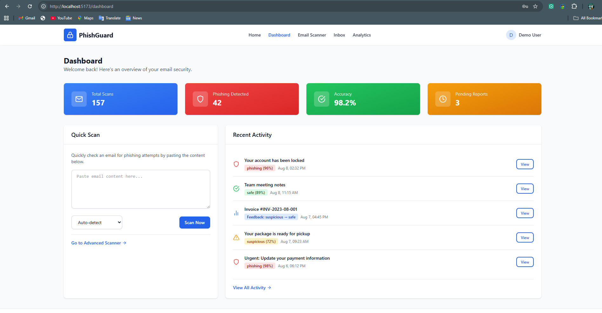
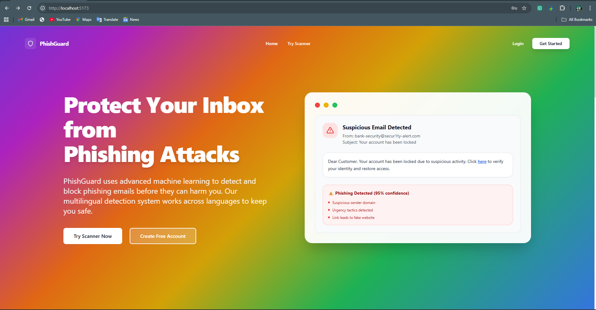
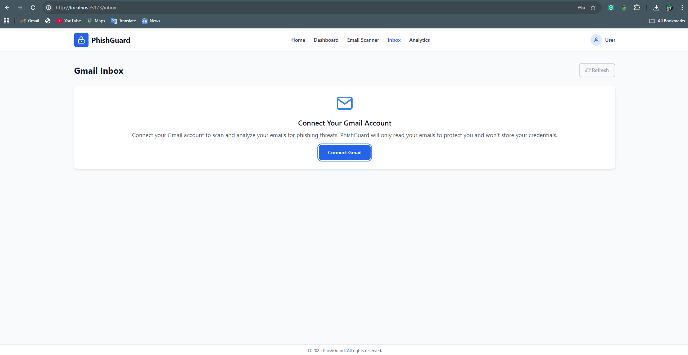
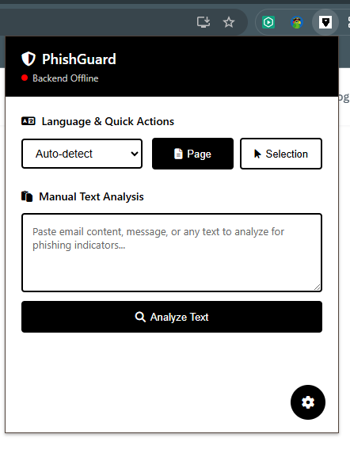

# 🛡️ PhishGuard - Advanced Phishing Detection Platform

<!-- CI/CD Test: Pipeline verification - 2025-01-20 -->

<div align="center">
  
  
  [](https://www.python.org/)
  [](https://reactjs.org/)
  [](https://flask.palletsprojects.com/)
  [](LICENSE)
  
  **A comprehensive, full-stack phishing detection platform using advanced machine learning and NLP techniques**
</div>

## 📋 Table of Contents

- [Overview](#-overview)
- [Features](#-features)
- [Architecture](#-architecture)
- [Technology Stack](#-technology-stack)
- [Screenshots](#-screenshots)
- [Installation](#-installation)
- [Usage Guide](#-usage-guide)
- [API Documentation](#-api-documentation)
- [Chrome Extension](#-chrome-extension)
- [Contributing](#-contributing)
- [License](#-license)

## 🎯 Overview

PhishGuard is a sophisticated phishing detection platform that combines machine learning, natural language processing, and real-time analysis to protect users from phishing attacks across multiple languages. The platform consists of three main components:

- **Backend API**: Python/Flask server with ML-powered email analysis
- **Frontend Web App**: Modern React application with real-time dashboard
- **Chrome Extension**: Browser integration for instant phishing detection

### Key Capabilities

- 🔍 **Multi-language Support**: Detects phishing in English, Sinhala, Tamil, Hindi, Spanish, French
- 🤖 **Advanced ML Models**: XGBoost-based classification with TF-IDF vectorization
- 🌐 **Real-time Analysis**: Instant scanning with detailed threat breakdown
- 📊 **Analytics Dashboard**: Comprehensive security metrics and reporting
- 🔐 **User Authentication**: Secure JWT-based user management
- 📱 **Responsive Design**: Works seamlessly across all devices

## ✨ Features

### Core Detection Features
- **Email Content Analysis**: Deep analysis of email text, headers, and metadata
- **URL & Domain Analysis**: Comprehensive link and domain reputation checking
- **Language Detection**: Automatic language identification and translation
- **Threat Scoring**: Confidence-based risk assessment with detailed breakdown
- **Suspicious Element Detection**: Identifies specific phishing indicators

### User Experience Features
- **Real-time Scanning**: Instant analysis with progress indicators
- **Scan History**: Complete audit trail of all scans and results
- **Export Capabilities**: PDF reports and data export functionality
- **Dashboard Analytics**: Visual representation of security metrics
- **User Management**: Registration, authentication, and profile management

### Security Features
- **JWT Authentication**: Secure token-based authentication
- **CORS Protection**: Cross-origin request security
- **Input Validation**: Comprehensive data validation and sanitization
- **Rate Limiting**: Protection against abuse and spam

## 🏗️ Architecture

```
PhishGuard Platform
├── Backend (Python/Flask)
│   ├── ML Models (XGBoost, TF-IDF)
│   ├── API Endpoints (RESTful)
│   ├── Database (MongoDB)
│   └── Authentication (JWT)
├── Frontend (React/Vite)
│   ├── Dashboard & Analytics
│   ├── Email Scanner Interface
│   ├── User Management
│   └── Real-time Updates
└── Chrome Extension
    ├── Page Content Analysis
    ├── Context Menu Integration
    └── Backend Communication
```

## 🛠️ Technology Stack

### Backend
- **Framework**: Flask (Python)
- **Database**: MongoDB
- **ML Libraries**: scikit-learn, XGBoost, NLTK
- **Authentication**: JWT, bcrypt
- **NLP**: TF-IDF Vectorization, Language Detection
- **Translation**: Google Translate API

### Frontend
- **Framework**: React 19.1.1
- **Build Tool**: Vite
- **Styling**: Tailwind CSS
- **Charts**: Chart.js, React Charts
- **Forms**: Formik with Yup validation
- **Routing**: React Router DOM
- **State Management**: React Context API

### Chrome Extension
- **Manifest**: V3
- **Content Scripts**: Page analysis
- **Background Scripts**: API communication
- **Storage**: Chrome Sync Storage

## 📸 Screenshots

### Main Dashboard

*Comprehensive dashboard showing security metrics, recent scans, and threat overview*

### Home Page

*Modern landing page with feature highlights and quick access to scanning tools*

### Gmail Integration

*Seamless integration with email services for enhanced phishing detection*

### Chrome Extension


*Browser extension providing real-time phishing detection while browsing*

## 🚀 Installation

### Prerequisites

- **Python 3.8+**
- **Node.js 14+**
- **MongoDB 4.4+**
- **Google Chrome** (for extension)

### Backend Setup

1. **Clone the repository**
   ```bash
   git clone https://github.com/Kavindu80/Phishing-Detection-Platform.git
   cd Phishing-Detection-Platform/backend
   ```

2. **Create virtual environment**
   ```bash
   python -m venv venv
   source venv/bin/activate  # On Windows: venv\Scripts\activate
   ```

3. **Install dependencies**
   ```bash
   pip install -r requirements.txt
   ```

4. **Configure environment**
   ```bash
   # Create .env file
   FLASK_APP=app.py
   FLASK_ENV=development
   SECRET_KEY=your-secret-key
   JWT_SECRET_KEY=your-jwt-secret
   MONGO_URI=mongodb://localhost:27017/phishguard
   ```

5. **Initialize database**
   ```bash
   python init_db.py
   ```

6. **Start the backend**
   ```bash
   python app.py
   ```

### Frontend Setup

1. **Navigate to frontend directory**
   ```bash
   cd ../frontend
   ```

2. **Install dependencies**
   ```bash
   npm install
   ```

3. **Start development server**
   ```bash
   npm run dev
   ```

4. **Access the application**
   ```
   http://localhost:5173
   ```

### Chrome Extension Setup

1. **Open Chrome Extensions**
   ```
   chrome://extensions/
   ```

2. **Enable Developer Mode**

3. **Load Extension**
   - Click "Load unpacked"
   - Select `chrome-extension` folder

4. **Configure Backend URL**
   - Click extension icon → Settings
   - Set backend URL: `http://127.0.0.1:5000`

## 📖 Usage Guide

### Web Application

#### 1. Registration & Login
- Visit the application homepage
- Click "Register" to create an account
- Use email and password for authentication
- Access your personalized dashboard

#### 2. Email Scanning
- **Quick Scan**: Paste email content directly
- **File Upload**: Upload email files (.txt, .eml)
- **Language Selection**: Choose specific language or auto-detect
- **Analysis**: View detailed threat assessment

#### 3. Dashboard Features
- **Recent Scans**: View latest scan results
- **Analytics**: Monitor security trends
- **Export Data**: Download reports in PDF format
- **User Settings**: Manage profile and preferences

### Chrome Extension

#### 1. Page Analysis
- Click extension icon to scan current page
- View real-time threat assessment
- Get detailed breakdown of suspicious elements

#### 2. Text Selection
- Highlight text on any webpage
- Right-click → "Scan selected text for phishing"
- Receive instant analysis results

#### 3. Manual Input
- Open extension popup
- Paste suspicious content
- Choose language and analyze

### API Usage

#### Public Scanning
```bash
curl -X POST http://localhost:5000/api/scan \
  -H "Content-Type: application/json" \
  -d '{
    "emailText": "Your email content here",
    "language": "auto"
  }'
```

#### Authenticated Scanning
```bash
curl -X POST http://localhost:5000/api/scan/auth \
  -H "Authorization: Bearer YOUR_JWT_TOKEN" \
  -H "Content-Type: application/json" \
  -d '{
    "emailText": "Your email content here",
    "language": "auto"
  }'
```

## 🔌 API Documentation

### Authentication Endpoints

| Method | Endpoint | Description |
|--------|----------|-------------|
| POST | `/api/auth/register` | User registration |
| POST | `/api/auth/login` | User login |
| GET | `/api/auth/me` | Get current user |
| PUT | `/api/auth/user/:id` | Update user profile |

### Scanning Endpoints

| Method | Endpoint | Description |
|--------|----------|-------------|
| POST | `/api/scan` | Public email scanning |
| POST | `/api/scan/auth` | Authenticated scanning |
| GET | `/api/history` | Get scan history |
| GET | `/api/history/:id` | Get specific scan details |

### Analytics Endpoints

| Method | Endpoint | Description |
|--------|----------|-------------|
| GET | `/api/analytics` | Get analytics data |
| GET | `/api/analytics/export` | Export analytics data |

### Utility Endpoints

| Method | Endpoint | Description |
|--------|----------|-------------|
| GET | `/api/health` | Health check |
| GET | `/api/model/status` | ML model status |

## 🔧 Chrome Extension

### Features
- **Real-time Page Analysis**: Scan entire web pages for phishing indicators
- **Context Menu Integration**: Right-click to scan selected text
- **Manual Text Analysis**: Paste and analyze suspicious content
- **Multi-language Support**: Automatic language detection
- **Backend Integration**: Seamless communication with API

### Installation
1. Enable Developer Mode in Chrome
2. Load unpacked extension from `chrome-extension` folder
3. Configure backend URL in extension settings
4. Optional: Enable authentication for saved scans

### Usage
- **Page Scan**: Click extension icon to analyze current page
- **Selection Scan**: Highlight text → right-click → scan
- **Manual Input**: Open popup → paste content → analyze

## 🤝 Contributing

We welcome contributions to PhishGuard! Please follow these steps:

1. **Fork the repository**
2. **Create a feature branch**
   ```bash
   git checkout -b feature/your-feature-name
   ```
3. **Make your changes**
4. **Test thoroughly**
5. **Submit a pull request**

### Development Guidelines
- Follow PEP 8 for Python code
- Use ESLint for JavaScript/React code
- Write comprehensive tests
- Update documentation as needed

## 📄 License

This project is licensed under the MIT License - see the [LICENSE](LICENSE) file for details.

## 🙏 Acknowledgments

- **SLTC Research University** - Academic support and guidance
- **Open Source Community** - Libraries and tools used
- **Machine Learning Community** - Research and algorithms

---

<div align="center">
  <p>Made with ❤️ by <strong>Kavindu Liyanage</strong></p>
</div> 
